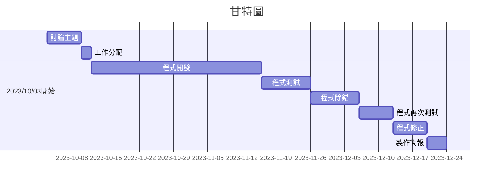

# system_analysis_team11
專題名稱：請購單管理系統

組長：毛云蓁

組員：楊程宇、余欣恬、劉惠欣、蔣宗勳

專題簡介：使用primeNG的UI元件和primeflex的排版工具，為請購部門設計一個直觀的用戶界面，當公司員工交給

請購部門請購單時，請購部門能夠利用線上系統進行整合、管理，並擁有新增、編輯、更新、刪除四種功能（CRUD），

前端進行版面及按鈕設計，確保用戶可以輕鬆管理請購單，定義欄位名稱，表格內容包含申請人、請購編號、公司名稱、

請購部門、品名、請購數量、單價及創建者，每個欄位都有相應的標籤，使用戶明確知道應該輸入的資料。

後端進行資料庫建立、管理跟資料維護，處理前端請求並與資料庫進行交互，使CRUD能夠操作順利。

前端使用Angular的HttpClient模塊來發送HTTP請求到後端API端點，後端建立適當的API路由和控制器，以處理前端請求，

使CRUD操作能夠順利執行，成功接上API後，當用戶執行操作時，資料將即時更新，確保信息的即時性。

# 工作任務

| 姓名 | 工作內容 |
| :-: | :-: |
| 毛云蓁 | 前端程式頁面撰寫、製作簡報 |
| 余欣恬 | 前端程式頁面撰寫 |
| 劉惠欣 | 前端程式頁面撰寫 |
| 蔣宗勳 | 後端資料庫程式撰寫|
| 楊程宇 | 軟體測試、製作簡報 |

# 專題甘特圖與PERT/CPM圖

