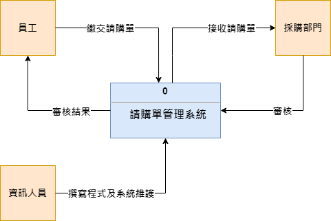

# system_analysis_team11
專題名稱：請購單管理系統

組長：毛云蓁

組員：楊程宇、余欣恬、劉惠欣、蔣宗勳

專題簡介：使用primeNG的UI元件和primeflex的排版工具，為採購部門設計一個直觀的用戶界面，當公司員工交給

採購部門請購單時，採購部門能夠利用線上系統進行整合、管理，並擁有新增、讀取、編輯、刪除四種功能（CRUD），

前端進行版面及按鈕設計，確保用戶可以輕鬆管理請購單，定義欄位名稱，表格內容包含編號、申請人、公司名稱、請購部門、品名、單價、請購數量、用途、創建者、創建時間及審核狀態，每個欄位都有相應的標籤，使用戶明確知道應該輸入的資料。

後端進行資料庫建立、管理跟資料維護，處理前端請求並與資料庫進行交互，使CRUD能夠操作順利。

前端使用Angular的HttpClient模塊來發送HTTP請求到後端API端點，後端建立適當的API路由和控制器，以處理前端請求，

使CRUD操作能夠順利執行，成功接上API後，當用戶執行操作時，資料將即時更新，確保信息的即時性。

# 工作任務

| 學號 | 姓名 | 工作內容 |
|:-:| :-: | :-: |
| C110118219 | 毛云蓁 | 前端程式頁面撰寫、製作簡報 |
| C110118232 | 余欣恬 | 前端程式頁面撰寫、製作簡報 |
| C110118236 | 劉惠欣 | 前端程式頁面撰寫、製作簡報 |
| C110118242 | 蔣宗勳 | 後端資料庫程式撰寫、報告|
| C110118225 | 楊程宇 | 軟體測試、報告 |

# 專題甘特圖與PERT/CPM圖

# PERT/CPM圖

# 至少各三項的功能性需求與非功能性需求
1. 功能性需求：
* 新增請購單（Create）：採購部門及員工皆能夠新增一個請購單，填入相應的資料，包括申請人、請購部門、品名、單價、請購數量、用途、創建者等。
* 查詢請購單（Read）：採購部門能夠查詢和瀏覽現有的請購單，員工僅能查詢自己的請購單。
* 編輯請購單（Update）：採購部門能夠編輯現有的請購單，修改相應的資料。
* 刪除請購單（Delete）：採購部門能夠刪除現有的請購單。

2. 非功能性需求：
* 直觀性：用戶界面應該是直觀的，用戶能夠輕易理解如何使用系統。
* 可用性：系统是可用的，保證高可靠性和穩定性。
* 可擴展性：系统應該能夠容易地擴展，以適應未來的需求變化。
* 實時性：對於數據更新的操作，能夠提供即時的反饋和數據更新。
* 一致性：數據在前端和後端之間保持一致，確保操作的正確性。

# 呈現功能分解圖

# 寫出如ppt p20的需求分析的文字描述
### 請購單管理系統需求分析
(1) 採購部門可以藉由載入請購單管理系統申請該員工所需採購的品項、數量等。   
(2) 公司員工可以新增及讀取自己的請購申請。
(3) 採購部門依照請購單管理系審核請購申請。   
(4) 採購部門依照請購單管理系統核算金額是否會超出可用預算。   
(5) 採購部門透過請購單管理系統通知是否審核通過。   
(6) 假如請購單申請通過，採購部門則採購該申請所需的材料，公司員工可追蹤請購單狀況為已通過、審核中或是已取消。   

# 劃出使用案例圖與三個以上的使用案例說明

使用案例說明

### 使用Figma劃出第一個使用案例的動態模擬畫面

### 系統環境圖(DFD)

### DFD 圖0

### 繪出UML類別圖(CLASS DIAGRAM)

# 循序圖與活動圖
案例1循序圖

案例1活動圖

案例2循序圖

案例2活動圖

案例3循序圖

案例3活動圖

案例4循序圖

案例4活動圖

# 分鏡板

# 實體關係圖(ERD)

# 組合實體

