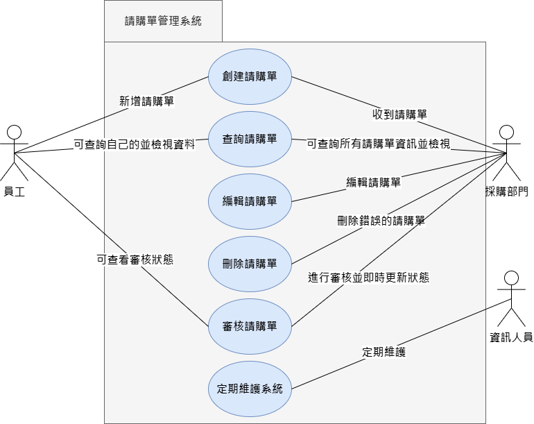

# system_analysis_team11
專題名稱：請購單管理系統

組長：毛云蓁

組員：楊程宇、余欣恬、劉惠欣、蔣宗勳

專題簡介：使用primeNG的UI元件和primeflex的排版工具，為請購部門設計一個直觀的用戶界面，當公司員工交給

請購部門請購單時，請購部門能夠利用線上系統進行整合、管理，並擁有新增、編輯、更新、刪除四種功能（CRUD），

前端進行版面及按鈕設計，確保用戶可以輕鬆管理請購單，定義欄位名稱，表格內容包含申請人、請購編號、公司名稱、

請購部門、品名、請購數量、單價及創建者，每個欄位都有相應的標籤，使用戶明確知道應該輸入的資料。

後端進行資料庫建立、管理跟資料維護，處理前端請求並與資料庫進行交互，使CRUD能夠操作順利。

前端使用Angular的HttpClient模塊來發送HTTP請求到後端API端點，後端建立適當的API路由和控制器，以處理前端請求，

使CRUD操作能夠順利執行，成功接上API後，當用戶執行操作時，資料將即時更新，確保信息的即時性。

# 工作任務

| 學號 | 姓名 | 工作內容 |
|:-:| :-: | :-: |
| C110118219 | 毛云蓁 | 前端程式頁面撰寫、製作簡報 |
| C110118232 | 余欣恬 | 前端程式頁面撰寫 |
| C110118236 | 劉惠欣 | 前端程式頁面撰寫 |
| C110118242 | 蔣宗勳 | 後端資料庫程式撰寫|
| C110118225 | 楊程宇 | 軟體測試、製作簡報 |

# 專題甘特圖與PERT/CPM圖

# PERT/CPM圖

# 至少各三項的功能性需求與非功能性需求
1. 功能性需求：
* 新增請購單（Create）：用戶能夠新增一個請購單，填入相應的資料，包括申請人、請購編號、公司名稱、請購部門、品名、請購數量、單價、創建者等。
* 查詢請購單（Read）：用戶能夠查詢和瀏覽現有的請購單。
* 編輯請購單（Update）：用戶能夠編輯現有的請購單，修改相應的資料。
* 刪除請購單（Delete）：用戶能夠刪除現有的請購單。

2. 非功能性需求：
* 直觀性：用戶界面應該是直觀的，用戶能夠輕易理解如何使用系統。
* 可用性：系统是可用的，保證高可靠性和穩定性。
* 可擴展性：系统应该能够容易地扩展，以适应未来的需求变化。
* 實時性：對於數據更新的操作，能夠提供及时的反饋和數據更新。
* 一致性：數據在前端和後端之間保持一致，確保操作的正確性。

# 呈現功能分解圖

# 寫出如ppt p20的需求分析的文字描述
### 請購單管理系統需求分析
(1) 公司員工可以藉由載入請購單管理系統申請該應客戶需求所需採購的材料、數量等。   
(2) 公司員工可以藉由載入以及新增、讀取、刪除、編輯請購申請。  
(3) 採購部門依照請購單管理系審核請購申請。   
(4) 採購部門依照請購單管理系統核算金額是否會超出可用預算。   
(5) 採購部門透過請購單管理系統通知是否審核通過。   
(6) 假如請購單申請通過，公司員工可追蹤請購單狀況為已批准或已完成。   
(7) 假如請購單申請未通過，公司員工可透過請購單管理系統得知未通過原因。   

# 劃出使用案例圖與三個以上的使用案例說明

使用案例說明

### 使用Figma劃出第一個使用案例的動態模擬畫面

